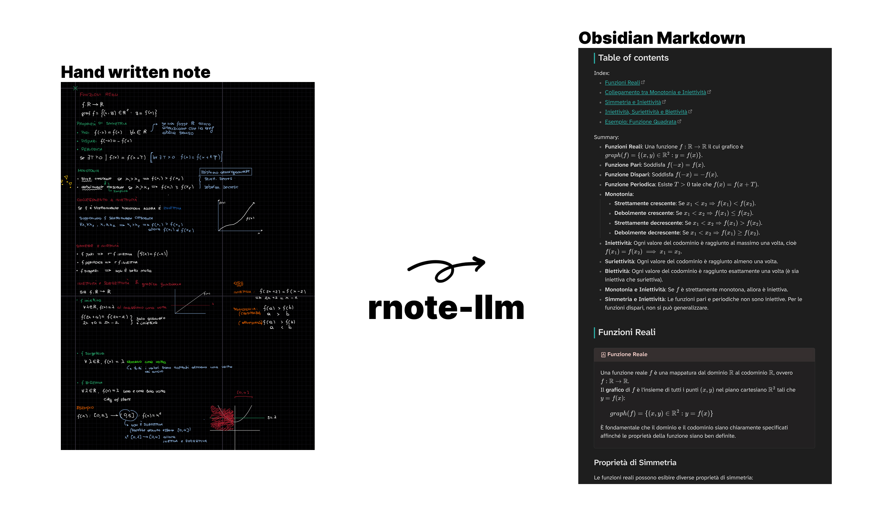

```
Usage: rnote-llm [OPTIONS] --key <KEY> <COMMAND>

Commands:
  single  
  batch   
  help    Print this message or the help of the given subcommand(s)

Options:
  -k, --key <KEY>                      
  -m, --model <MODEL>                  [default: gemini25-flash] [possible values: gemini25-flash, gemini25-pro]
  -p, --prompt <PROMPT>                [default: default] [possible values: default, summarize, test]
  -s                                   
  -c, --custom-prompt <CUSTOM_PROMPT>  
  -h, --help  
```
